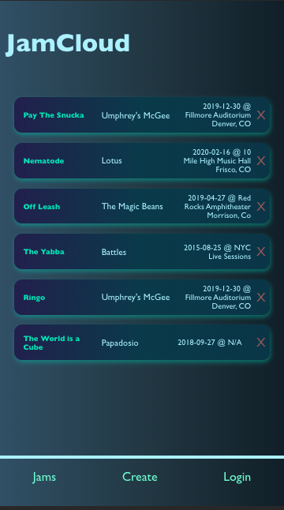
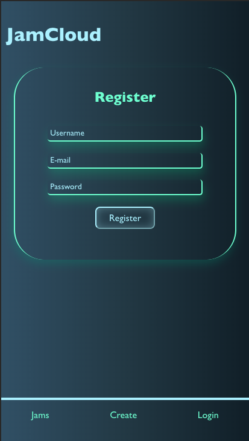
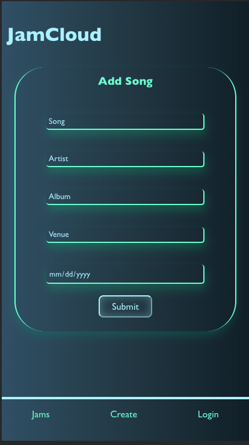
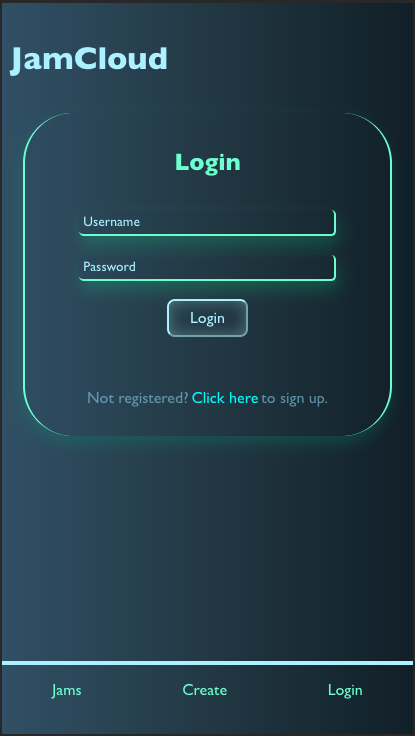

# Jamcloud-client
Jamcloud allows users to keep track of the various live recordings that their favorite artists have performed. With so many vastly different versions of the same song it can be near impossible to remember which versions stick out. Writing them down on paper doesn't fully solve the problem as you will end up with a list that is hard to search through and potentially littered with duplicates. Future features include a ranking system so that users can compare their favorites with other fans as well as discover jams they may be un familiar with. 

## Links 

- Backend Repo:   www.github.com/bilbertius/jc-s
- Frontend Repo:  www.github.com/bilbertius/jamcloud-client
- Live app:       www.jamcloud.now.sh

## Tech Stack 
### Front End:

- React

### Back End: 

- NodeJS 
- ExpressJS
- PostgreSQL

## Screenshots 
-

- 

- 

